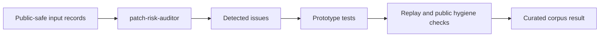

# Method: Patch Risk Auditor

## Tool Architecture

Custom tool: patch-risk-auditor

External package/tool evidence: acorn

Worker assurance: container-netoff

## Evidence Flow

The showcase result is selected only after quality, evidence, reproducibility,
publication safety, replay, safety scan, public hygiene, and anti-template gates
are represented in the public corpus metadata.

## Verification Method

Verification uses synthetic benign and suspicious patch examples so defensive scoring can be tested without producing exploit payloads.

## Source Evidence Summary

Source-card and claim/feature summaries are public evidence pointers. They are
not legal novelty conclusions and they do not replace human review.
